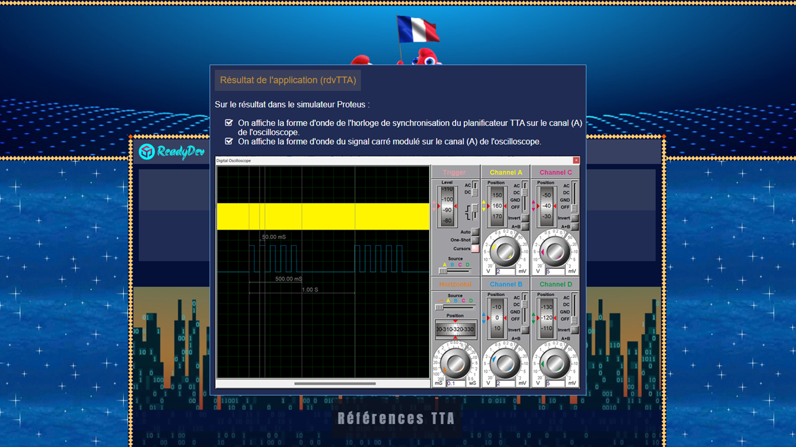

**TTA (Time-Triggered Architecture)** ou (**Architecture déclenchée par le temps**) 
est une approche de conception utilisée dans les systèmes embarqués temps réel 
pour garantir la prévisibilité, la fiabilité et la tolérance aux pannes. 
Elle est particulièrement pertinente dans les applications critiques pour la sécurité, 
telles que l'automobile, l'aérospatiale et les systèmes de contrôle industriel, 
où la synchronisation et la fiabilité sont cruciales pour le bon fonctionnement du système.

Dans ce tutoriel, vous apprendrez à implémenter la structure logicielle de l’ordonnanceur 
multi-tâches temps-réel **TTA** en langage **C** pour générer un signal carré modulé 
à partir d’un système embarqué basé sur le microcontrôleur **8051** avec l'utilisation du timer **T2**.

[Tutoriel](https://readydev.ovh/home/tutoriels/embedsys/references-tta "Suivre le tutoriel sur ReadyDEV") |
[Contact](https://www.linkedin.com/in/tia-gerard-kesse/ "Contactez-moi sur LinkedIn") |
[Demo](https://www.linkedin.com/posts/tia-gerard-kesse_c-r%C3%A9f%C3%A9rences-tta-time-triggered-architecture-activity-7358278488631484416-sPiF?utm_source=share&utm_medium=member_desktop&rcm=ACoAABOftRsB0Rh0MlSyRYweX14f_pNxyDgEm70 "Suivre la demo sur LinkedIn")

